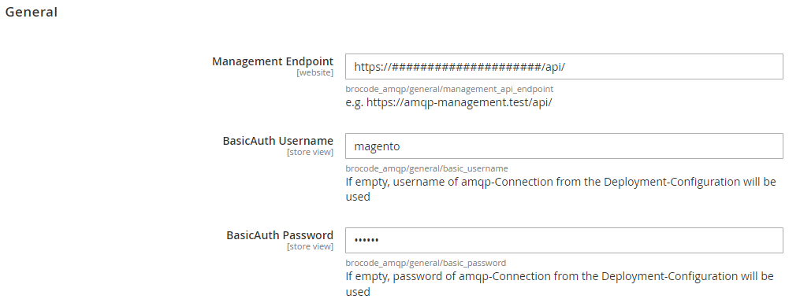
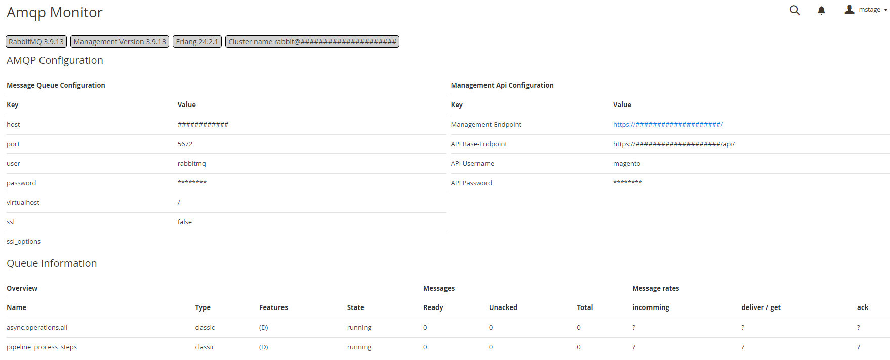

# BroCode AMQP Monitor

## Description
this module should show a basic information of the used AMQP server and it's configured queues in the Magento Backend

## Installation

`````` 
composer require brocode/module-amqp-monitor
bin/magento module:enable Brocode_AmqpMonitor
bin/magento setup:upgrade
`````` 

## Configuration

`` Stores > Configuration > Services > Amqp Monitor ``



## Usage

`` System > Tools > BroCode Amqp Monitor ``



## TODOs

* Add autoreload of the monitor page to refresh message statistics